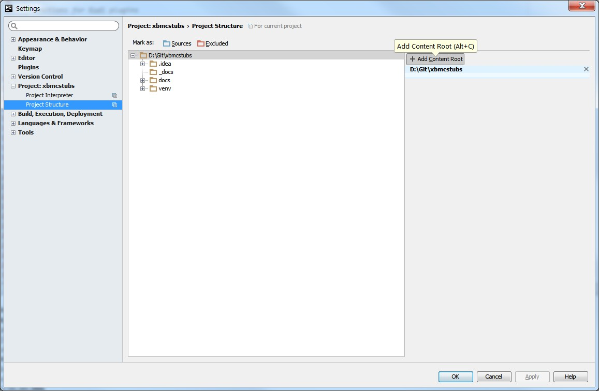
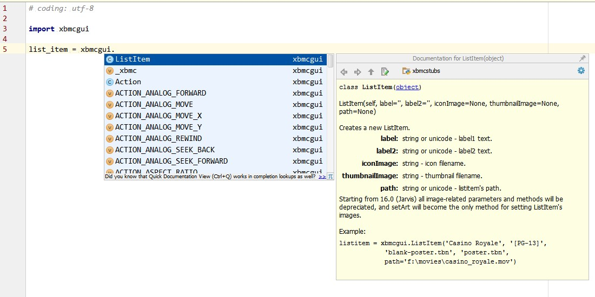
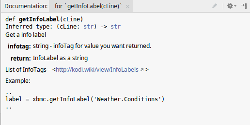
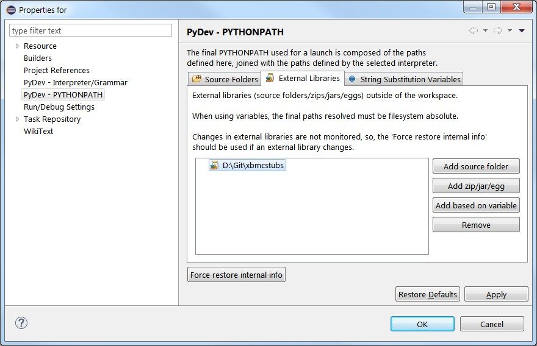
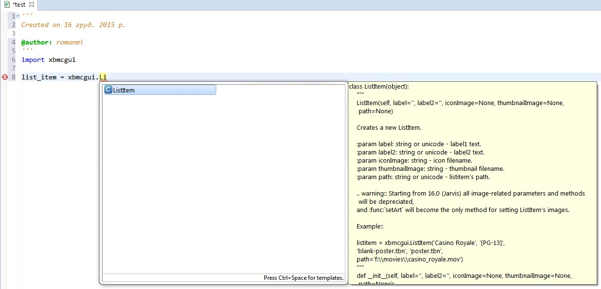
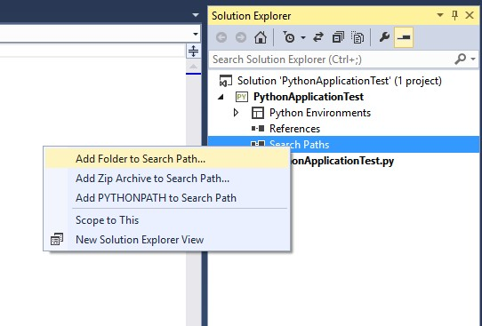
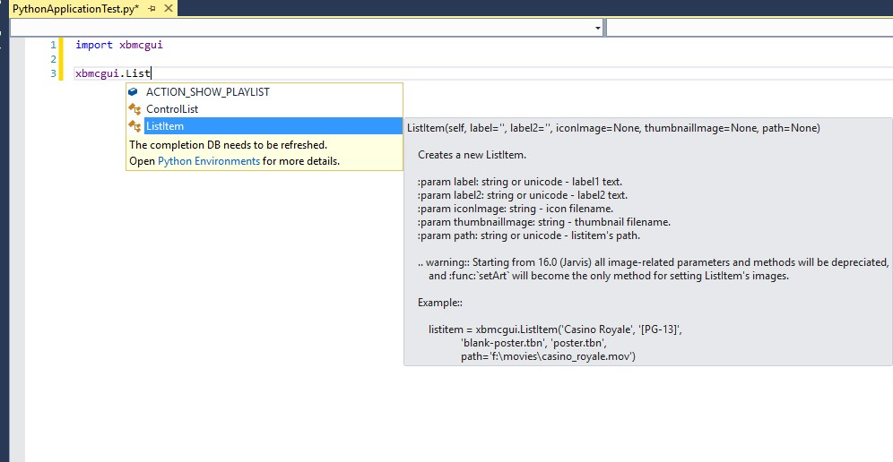
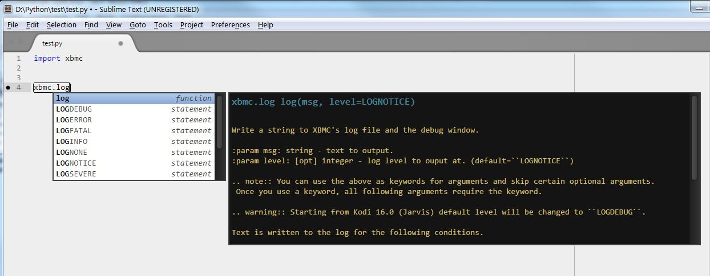

Using Kodistubs
###############

Writing Code
============

The main purpose of Kodistubs is to help you to write Kodi addon code in various
:abbr:`IDEs(Integrated Development Environments)` by providing code completion,
quick access to Kodi Python API docstrings, and code inspection (linting)
in IDEs that provide this feature.

Virtual Environment
-------------------

You can install Kodistubs in your working Python virtual environment
either from sources using :file:`setup.py` script::

  python setup.py install

or directly from PyPI using ``pip``::

  pip install Kodistubs

If you don't want to install Kodistubs into your Python environment,
below are the instructions for using Kodistubs in popular Python IDEs.

PyCharm
-------

To add Kodistubs to the current project open
:menuselection:`Settings --> Project --> Project Structure`,
click :guilabel:`+ Add Content Root` and select a folder where Kodistubs :file:`.py`
files are located.

    **Adding Kodistubs to the current project in PyCharm**

This enables code completion and docstrings pop-ups for Kodi Python API functions/classes/methods.
PyCharm also supports `PEP-484`_ type annotations so it should warn you if you
are trying to pass incompatible arguments to functions or methods.

    **Code completion and a docstring pop-up in PyCharm**

PyCharm docstrings pop-ups partially support reStructuredText formatting.

    **Function docstring pop-up in PyCharm**

Eclipse + PyDev
---------------

In PyDev right-click the project's name, select
:menuselection:`Properties --> PyDev - PYTHONPATH --> External Libraries`,
click :guilabel:`Add source folder` and select a  folder
where Kodistubs :file:`.py` files are located.

    **Adding Kodistubs to the current project in PyDev**

This enables code completion and docstrings pop-ups for Kodi Python API functions/classes/methods.

     **Code completion and a docstring pop-up in PyDev**

Python Tools for Visual Studio
------------------------------

In :guilabel:`Solution Explorer` right-click :guilabel:`Search Paths`,
in the context menu select :guilabel:`Add Folder To Search Path...`
and then select a folder where Kodistubs :file:`.py` files are located.

    **Adding Kodistubs to the current project in PTVS**

This enables code completion and docstrings pop-ups for Kodi Python API functions/classes/methods.

    **Code completion and a docstring pop-up in PTVS**

Sublime Text 3 + Anaconda
-------------------------

In :guilabel:`Preferences` select :menuselection:`Package Settings --> Anaconda --> Settings - User`,
and add the folder with Kodistubs :file:`.py` files to ``extra_paths`` list
of Anaconda User configuraiton file.

.. note:: Sublime Text configuration files have JSON formatting.

For example:

.. code-block:: json

  {
      "extra_paths":
      [
          "d:\\Python\\Kodistubs"
      ]
  }

This enables code completion and docstrings pop-ups for Kodi Python API functions/classes/methods.

    **Code completion and a docstring pop-up in Sublime Text 3**

Type Annotations
================

Kodistubs include `PEP-484`_ type annotations for all functions and methods
so you can use `mypy`_ or other compatible tool to check types of function/method
arguments and return values in your code.

.. code-block:: python
  :emphasize-lines: 2

  def getInfoLabel(cLine):
      # type: (str) -> str
      """
      Get a info label

      :param infotag: string - infoTag for value you want returned.
      :return: InfoLabel as a string

      List of InfoTags -- <http://kodi.wiki/view/InfoLabels>

      Example::

          ..
          label = xbmc.getInfoLabel('Weather.Conditions')
          ..
      """
      return ""

The following table explains some of the type annotations:

======================= ===========================================================
Type annotation         Function/method argument or return value
======================= ===========================================================
``str``                 Accepts or returns UTF-8 encoded byte string (:class:`str`)
``str_type``            Accepts both :class:`str` and :class:`unicode`
``int_type``            Accepts both :class:`int` and :class:`long`
``Union[type1, type2]`` Accepts or returns either ``type1`` or ``type2``
======================= ===========================================================

.. _PEP-484: https://www.python.org/dev/peps/pep-0484/#suggested-syntax-for-python-2-7-and-straddling-code
.. _mypy: http://mypy-lang.org/

Testing Code
============

You can use Kodistubs in combination with some mocking library, e.g. `mock`_,
to write unit tests for your addon code.

.. _mock: https://pypi.python.org/pypi/mock

Documenting Code
================

Currently `Sphinx`_ is in fact the standard tool for documenting Python code. But for generating
documentation from docstrings it requires that your modules can be imported without any side-effects
(i.e. exceptions). If you want to document your addon with Sphinx, add Kodi stubs folder to
:data:`sys.path` of :file:`conf.py` file in your Sphinx project and in most cases your addon modules will be
imported without issues. Just don't forget to protect your module-level exetutable code with
``if __name__ == '__main__'`` condition.

Also the root URL of this documentation (without :file:`index.html`) can be used as a reference point
for `intersphinx`_. For example::

    intersphinx_mapping = {
        'https://docs.python.org/2.7': None,
        'http://romanvm.github.io/Kodistubs': None,  # Reference to Kodi stubs
    }

This will enable cross-references to Kodi Python API objects in your Sphinx-generated documentation.

.. _Sphinx: http://www.sphinx-doc.org/en/stable/
.. _intersphinx: http://www.sphinx-doc.org/en/stable/ext/intersphinx.html
